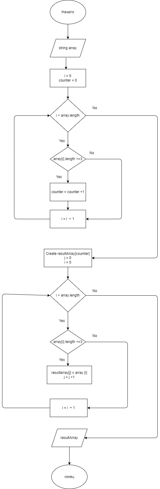

# Задача:

*Написать программу, которая из имеющегося массива строк формирует массив из строк, длина которых меньше либо равна 3 символа. Первоначальный массив можно ввести с клавиатуры, либо задать на старте выполнения алгоритма. При решении не рекомендуется пользоваться коллекциями, лучше обойтись исключительно массивами.*

# Решение:
### Для решения задачи были созданы функции:
1. FillArray для заполнения массива
2. PrintArray для печати массива
3. CountStringSymbols для подсчета количества элементов в массиве, длина которых меньше либо равна 3 символа
4. GenerateNewArray для создания нового массива, состоящего из строк, длина которых меньше либо равна 3 символа
### Алгоритм решения:
* создаем массив;
* наполняем массив строками (ввод в консоли);
* производим подсчета количества элементов в массиве, длина которых меньше либо равна 3 символа;
* создаем новый массив размером, равным количеству подсчитанных элементов;
* заполняем новый массив элементами, длина которых меньше либо равна 3 символа;
* выводим на печать исходный массив и и новый массив.

### Блок-схема решения задачи:
